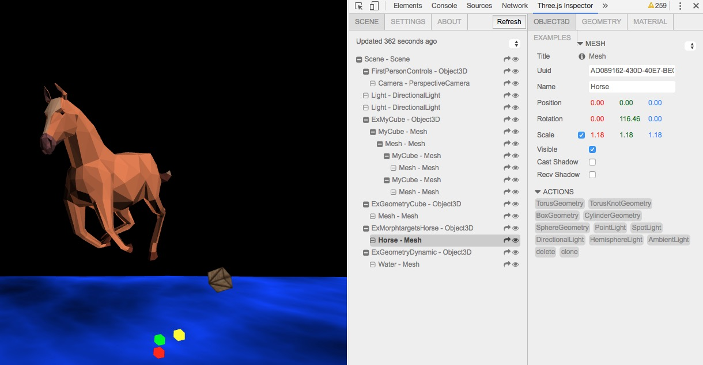

# react-threejs

WIP: Simplest bindings between [React][react] & [Three.js][threejs]

http://fritx.github.io/react-threejs/example/

See also: [vue-threejs](https://github.com/fritx/vue-threejs)




```js
import React, { Component } from 'react'
import { Renderer, Camera, Scene } from 'react-threejs'
```

```jsx
render () {
  return (<Renderer size={rendererSize}>
    <Camera position={{ z: 5 }} />
    <Scene>
      <MyCube color={0x00ff00} rotation={rotation}>
        <MyCube color={0xff0000} position={{ y: 2 }} />
        <MyCube color={0x0000ff} position={{ z: 3 }} />
      </MyCube>
    </Scene>
  </Renderer>)
}
```

```jsx
// setting FirstPersonControls, PositionalAudio & more
render () {
  return (<Renderer size={rendererSize}>
    <Scene>
      <FirstPersonControls>
        <AudioListener />
        <Camera />
      </FirstPersonControls>
      <Mesh rotation={rotation} geometry={geometry} material={material}>
        <PositionalAudio url="Project_Utopia.ogg" />
      </Mesh>
    </Scene>
  </Renderer>)
}
```


[react]: https://github.com/facebook/react
[threejs]: https://github.com/mrdoob/three.js
